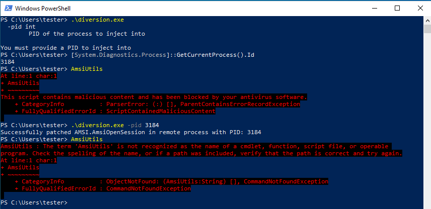

# diversion

## Overview
Diversion is able to bypasses AMSI in a 64bit process by providing the PID.


## Requirements
Diversion is written in Go and requires the windows library.

```bash
go get golang.org/x/sys/windows
```

Once installed, you can build the binary using the Makefile or the build command below on Linux or Mac:

```bash
GOOS=windows GOARCH=amd64 go build -ldflags "-s -w" -trimpath -o diversion.exe
```

## Examples
Diversion requires the PID of the process to inject into.

```bash
./diversion.exe
  -pid int
    	Process ID to inject into
```

Simple check to see that running `AmsiUtil` gets marked as malicious before bypassing Amsi.



## Future Improvements
- Update to work with 32bit processes
- Additional AMSI bypasses
- ETW bypasses
- DLL unhooking

## References / Credit

Amsi bypass technique converted from boku7's BOFF
- https://github.com/boku7/injectAmsiBypass

