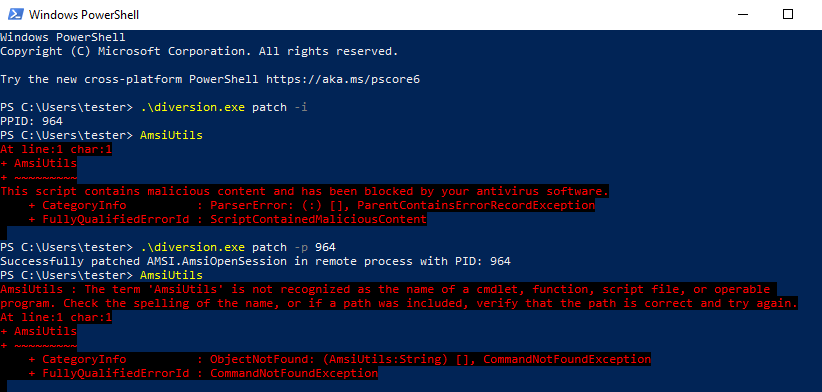

# diversion

## Overview
Diversion is a suite of commands that can be useful when performing internal penetration tests or red teams. The commands include dumping process memory, patching functions to bypass security tools, and performing network scans.

## Compiling
You can compile the binary using the Makefile or the build command below on Linux or Mac:

```bash
GOOS=windows GOARCH=amd64 go build -ldflags "-s -w" -trimpath -o diversion.exe
GOOS=windows GOARCH=386 go build -ldflags "-s -w" -trimpath -o diversion32.exe
```

## Commands

Overview of available commands.

```powershell
PS C:\Users\tester> diversion.exe
Suite of commands to use when performing Windows penetration testing.

Usage:
  diversion [command]

Available Commands:
  dump        Dump process memory using MiniDumpWriteDump
  help        Help about any command
  patch       Patch the specified function
  scan        Quick and portable TCP scanner

Flags:
  -h, --help   help for diversion

Use "diversion [command] --help" for more information about a command.
```

### Dump


```powershell
PS C:\Users\tester> diversion.exe dump
Dump process memory using MiniDumpWriteDump

Usage:
  diversion dump [flags]

Flags:
  -h, --help             help for dump
  -o, --outfile string   File to save the memory dump to
  -p, --pid int          PID of the process to dump
```

### Patch

Diversion is able to bypasses Amsi and ETW in both 32bit and 64bit processes by patching the functions to prevent them from analyzing a process.


**Amsi**


```powershell
PS C:\Users\tester> .\diversion.exe patch
Patch the specified function

Usage:
  diversion patch [flags]

Flags:
  -h, --help            help for patch
  -m, --method string   Evasion method: amsi,etw (default "amsi")
  -p, --pid int         PID of the process to inject into
  -i, --ppid            Get the PPID of current process
```

Simple check to see that running `AmsiUtil` gets flagged as malicious before bypassing Amsi. After running diversion, the command is no longer flagged as malicious.

```powershell
diversion.exe patch -i
diversion.exe patch -p [process id]
```



#### ETW

Using ProcessHacker to view the loaded .NET Assemblies within a process when using execute-assembly.


No .NET assemblies will be displayed when bypassing ETW.

```powershell
diversion.exe patch -p [process id] -m etw
```


### Scan


```powershell
PS C:\Users\tester> .\diversion.exe scan
Quick and portable TCP scanner. Provides some basic functionality like reading a list of hosts, saving the results to a file, and adjusting the timeout and number of hosts to scan concurrently

Usage:
  diversion scan [flags]

Flags:
  -f, --file string    Input file containing a list of hosts to scan
  -h, --help           help for scan
  -i, --ip string      Single host or CIDR address to scan
  -o, --open           Only output open ports (default true)
  -p, --ports string   Ports to scan (comma separated)
  -s, --save string    File to save the results
  -d, --threads int    Number of hosts to scan concurrently (default 20)
  -t, --timeout int    Timeout in seconds for each scanned port (default 3) 
```

## Future Improvements

- **Assembly** - Incorporate .NET execute assembly similar to C2 functionality
- **Dump** - Add additional methods like PssCaptureSnapshot and finding other handles to lsass
- **Token** - Add the ability to manage and perform tokens impersonation


## References / Credit

Amsi bypass technique converted from boku7's BOFF.
- https://github.com/boku7/injectAmsiBypass

ETW bypass technique coverted from mdsec example. Boku7 also created a BOFF file which uses Syscalls.
- https://www.mdsec.co.uk/2020/03/hiding-your-net-etw/
- https://github.com/boku7/injectEtwBypass
